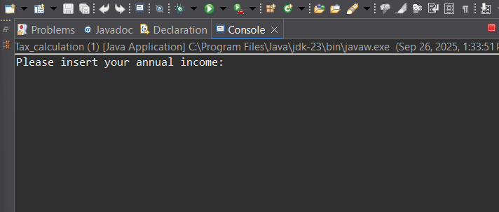

## Demo

Short Java application that calculates income tax with the following rule:

• Income ≤ 0 → tax 0.00€

• Income > 0 and ≤ 11000 → tax 20% on the entire income

• Income > 11000 → tax 25% on the entire income

Features:

• Simple user input with Scanner.

• Check for non-positive income.

• Format the result to two decimal places and the euro symbol.

• Easy to extend for multiple brackets or different taxation rules.

Prerequisites:

• Java JDK installed (version 8+).

• When prompted, enter your annual income (e.g. 20000) and press Enter. The program will display the calculated tax.

Extension Suggestions:

• Tax calculation with progressive brackets (tax rates by income segment).

• Support input from CSV file for bulk calculations.
